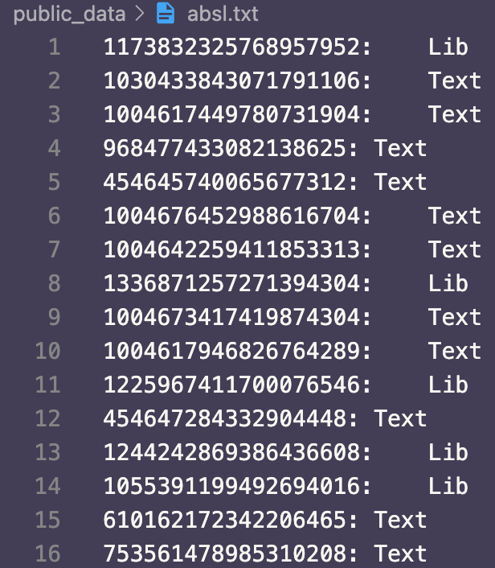

# Structure
# Data
By following Twitter data sharing recommendation and policy, check here https://developer.twitter.com/en/developer-terms/more-on-restricted-use-cases, we can only share the tweet ids.

Please check the corresponding tweet by using Twitter API. One simple way is to append the tweet_id after `https://twitter.com/i/web/status/`, you will be able to see the corresponding tweet.

Our data is under `./public_data`.

Take `./public_data/absl.txt` as an example: as the following image shows, the first column is the tweet id, and the second column is the label: 'Text' indicates it is not library-related; 'Lib' indicates it is a library-related.

 


## Pre-trained Transformer Models
0. Install the required packages
```
$ pip install -r requirements.txt
```
Go to the `./src` folder

1. Preprocess the data first
```
$ python preprocessing.py
```

2. within-library setting
```
python BERT_within_library.py --variant BERT --lib_name boto --seed 42
```

3. cross-library setting
```
python BERT_cross.py --variant BERT --seed 42
```

4. mixed setting
```
python BERT_stratified.py --variant BERT --seed 42
```

For mixed- and cross- settings, the performance will be directly logged inside the log files. For within-library setting, in order to get the performance across five libraries, please run the script `./src/cal_within_result.py`.

## Baselines
### Strawman
The script is also inside `./src`.

```
python strawman.py
```

### Prasetyo et al.
The script is also inside `./src`.

```
python Prasetyo-approach --variant cross
```

### APIReal
Please refer to `./APIReal/README.md` for more details.

After getting the predictions, please run the script inside `./src` to calculate precision, recall and F1.

```
python cal_apireal_result.py
```

# Predicted results from PTM
You can find the predictions from PTM here: `./predictions/`